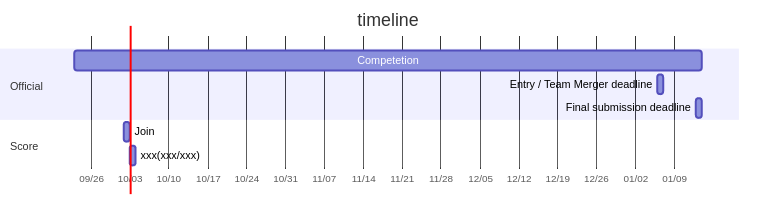

# [kaggle-brain-tumor](https://www.kaggle.com/c/rsna-miccai-brain-tumor-radiogenomic-classification)



## Overview

- Pet の人気度を推定する
- 結果の Submit は 1 日 2 回まで

## Diagram

- Init

  ```
  docker pull minlag/mermaid-cli
  ```

- Edit

  ```
  vi assets/diagram.mmd
  ```

- Build

  ```
  rm -f assets/diagram.png
  docker run -it -v $(pwd)/assets:/data minlag/mermaid-cli -i /data/diagram.mmd -o /data/diagram.png
  ```

## Docs

| Title | Read       | Comment |
| ----- | ---------- | ------- |
|       | 2021/10/xx |         |
|       | 2021/10/xx |         |
|       | 2021/10/xx |         |

## Diary

### 2021/10/03

- Google Colab で `submission.csv` まで作って出したら `Submission Scoring Error` に

  > How will winners be determined?
  > In some code competitions, winners will be determined by re-running selected submissions’ associated Notebooks on a private test set.
  >
  > In such competitions, you will create your models in Notebooks and make submissions based on the test set provided on the Data page. You will make submissions from your Notebook using the above steps and select submissions for final judging from the “My Submissions” page, in the same manner as a regular competition.
  >
  > Following the competition deadline, your code will be rerun by Kaggle on a private test set that is not provided to you. Your model's score against this private test set will determine your ranking on the private leaderboard and final standing in the competition.
  > https://www.kaggle.com/docs/competitions#notebooks-only-FAQ

  モデルの事前学習だけ Google Colab で、予測を Kaggle Notebook ですれば問題なさそう。  
  画像データからの特徴量作成も Kaggle Notebook でする必要がありそう。

### 2021/10/04

- とりあえず LightGBM で回してみた([2021/10/03 Pet Finder - Light GBM Baseline](https://www.kaggle.com/mstkmyhr/2021-10-03-pet-finder-light-gbm-baseline))(score: , time: )
